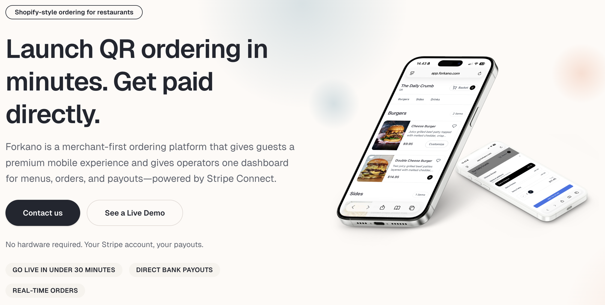

[Forkano](https://forkano.com) is built for independent restaurants that want a premium guest experience and full control of their payments. Think of it as "Shopify for restaurants": clean, fast, and simple to launch without special hardware or long onboarding. If you want to see the product or explore the guest flow, visit [forkano.com](https://forkano.com).

## Table of contents

1. [What Forkano Is](#what-forkano-is)
2. [Guest Experience](#guest-experience)
3. [Operator Experience](#operator-experience)
4. [Payments and Payouts](#payments-and-payouts)
5. [Who It Is For](#who-it-is-for)

## What Forkano Is

[Forkano](https://forkano.com) is a modern, merchant-first QR ordering and operations platform. Restaurants can launch QR ordering in minutes, manage menus centrally, accept card payments through Stripe Connect, and track orders in real time.

It combines a customer-facing mobile ordering flow (scan QR, browse menu, order, pay) with an operator dashboard for menus, orders, payouts, and settings. The focus is on speed, clarity, and control.

Unlike legacy ordering systems, [Forkano](https://forkano.com) is designed for independent operators who want a premium digital experience without enterprise overhead. The platform emphasizes usability and operational clarity so teams can focus on service instead of troubleshooting software.

## Guest Experience

The mobile ordering experience is designed to feel effortless:

- Scan a QR code and land on a fast, mobile-first menu
- Browse categories, modifiers, add-ons, and images
- Build a persistent cart and check out in seconds

The result is a smooth experience for guests and fewer bottlenecks for staff.

Because the flow is mobile-first, [Forkano](https://forkano.com) feels natural for guests: scan, browse, order, and pay without friction. It reduces wait times, keeps service moving during rushes, and gives customers a modern ordering option that does not require downloading an app.

## Operator Experience

Forkano gives operators a real-time view of service and a simple place to manage everything:

- Centralized menu builder with categories, modifiers, add-ons, images, and availability
- Live order streaming and status tracking
- Payment-linked order records for reliable reconciliation
- Branding, settings, and multi-currency support

Operators can update menus in one place and have changes reflected instantly across locations. This makes [Forkano](https://forkano.com) especially useful for restaurants with seasonal menus, specials, or fast-changing inventory.

## Payments and Payouts

Forkano uses Stripe Connect so the restaurant is the merchant of record. Payments go directly to the restaurant's own bank account, with clear payout visibility and refund audit trails.

This setup keeps ownership where it belongs and avoids the enterprise complexity that often comes with ordering platforms.

With [Forkano](https://forkano.com), restaurants get transparent payment processing, direct deposits, and clean records tied to each order. That translates to easier reconciliation and fewer end-of-month surprises.

## Who It Is For

Forkano is designed for small to mid-size restaurants that want:

- A premium guest experience without extra hardware
- Clear control over payments and payouts
- A reliable, real-time operations view
- A fast, minimal setup process

If that sounds like your restaurant, [Forkano](https://forkano.com) is built for you. Learn more and see the platform in action at [forkano.com](https://forkano.com).
