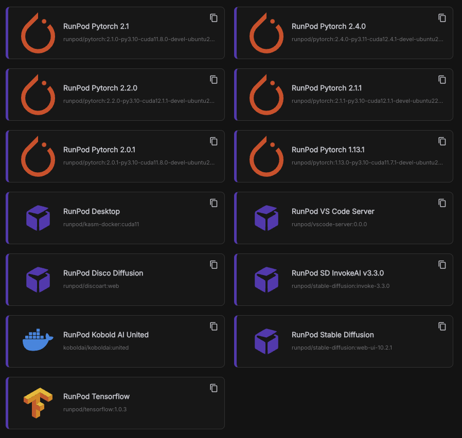
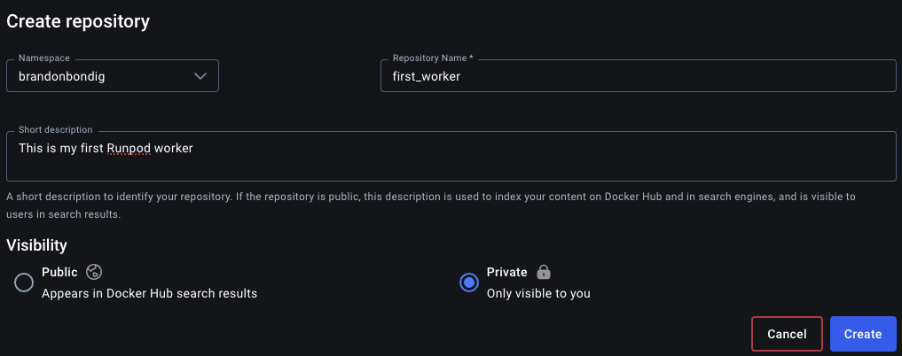
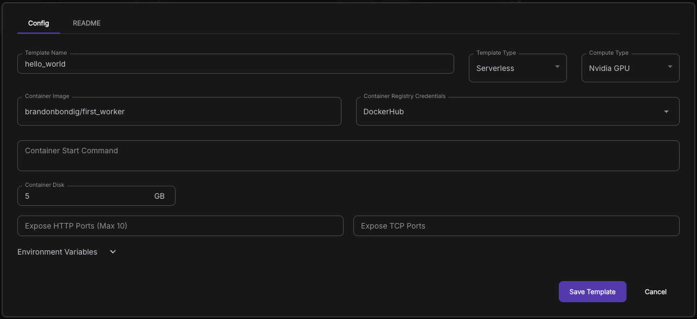
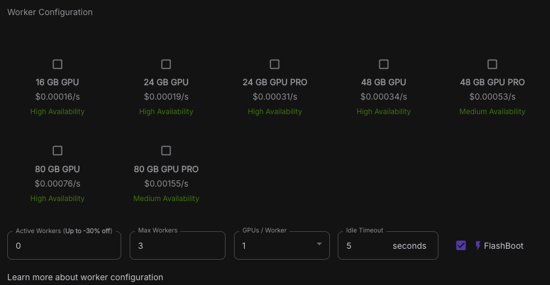
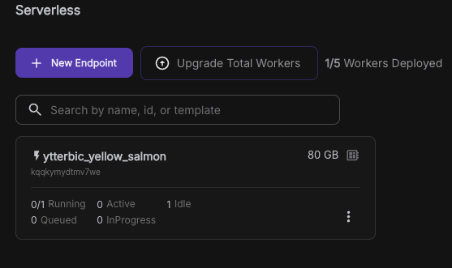
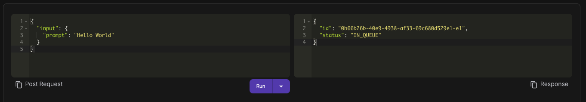

Heres some tips and trick to setting up your Runpod worker effectivly to get your AI project up and running in no time. This mostly covers the serverless aspect of Runpod.

## Table of contents

## Initial setup

The initial setup of a runpod worker proceeds that your already have [Python](https://www.python.org/) and [Docker](https://www.docker.com/) installed, as these are crucial for creating the template of your worker. The proceeding step is to clone the official [worker template](https://github.com/runpod-workers/worker-template) from the runpod repo.

```bash
git clone https://github.com/runpod-workers/worker-template.git
```

Once cloned, you’ll be met by a couple of files and folders. The `/src/handler.py` file will contain the main logic of your worker, where you will implement the primary functionality for handling tasks assigned to this worker. The `/builder` folder contains the necessary files to build your worker environment, including any specific dependencies and system-level requirements needed for your application to run effectively.

> It should be stressed that the folder structure is flexible and can be modified to suit your preferences. If you decide to make any changes, just be sure to update the Dockerfile accordingly to reflect the new structure.

In the root of the folder is the `Dockerfile`. This file dictates how your application environment is set up inside a Docker container. The `Dockerfile` includes instructions for building the container, including installing dependencies, setting up environment variables, and defining the runtime commands.

### Programming a runpod worker

Now you should have the necessary tools to begin programming your worker. You should start in the `src/handler.py` file, here you'll met the pre-written code:

```python
import runpod

def handler(job):
    job_input = job['input']

    name = job_input.get('name', 'World')

    return f"Hello, {name}!"


runpod.serverless.start({"handler": handler})
```

A runpod worker, works on a request basis, meaning they'll activate once a request is made to them via an API. You are able to post data via. the API, this is the main way you'll be interacting with the worker. In the example above, you'll see the line

```python
job_input = job['input']
```

This is where you can interact with the user inputs, I'll talk more about how to actually interact with the worker, later on.

In the example code, the worker expects an input `name` from the user, if `name` is not present, it'll use the word `World` instead it will then return the string `Hello, World!` or `Hello, some_name!` where `some_name` represents an arbitrary name the user has given as an input.

### Advanced example of a worker

A more advanced example of a worker, might include an LLM (Large Language Model) that takes some input and returns an output.

```python
import os
import runpod
from utils import JobInput
from engine import vLLMEngine, OpenAIvLLMEngine

vllm_engine = vLLMEngine()
OpenAIvLLMEngine = OpenAIvLLMEngine(vllm_engine)

async def handler(job):
    job_input = job["input"]
    user_message = job_input["message"]
    engine = OpenAIvLLMEngine if job_input.openai_route else vllm_engine

    results_generator = engine.generate(user_message)

    async for batch in results_generator:
        yield batch

runpod.serverless.start(
    {
        "handler": handler,
        "concurrency_modifier": lambda x: vllm_engine.max_concurrency,
        "return_aggregate_stream": True,
    }
)
```

This worker takes in a message from the user, then tries to generate a response, and then subsequently streams the response to the user, token wise.

## Testing your worker

To the the worker, please read the official documentation, supplied by Runpod [here](https://docs.runpod.io/serverless/workers/development/local-testing).

## The Dockerfile

The Dockerfile is essential in creating a Runpod worker, as workers operate based on Docker containers. It defines the environment, dependencies, and configuration necessary for the worker to function. If we take a look at the supplied Dockerfile:

```bash
FROM runpod/base:0.4.0-cuda11.8.0

# --- Optional: System dependencies ---
# COPY builder/setup.sh /setup.sh
# RUN /bin/bash /setup.sh && \
#     rm /setup.sh


# Python dependencies
COPY builder/requirements.txt /requirements.txt
RUN python3.11 -m pip install --upgrade pip && \
    python3.11 -m pip install --upgrade -r /requirements.txt --no-cache-dir && \
    rm /requirements.txt

# NOTE: The base image comes with multiple Python versions pre-installed.
#       It is reccommended to specify the version of Python when running your code.


# Add src files (Worker Template)
ADD src .

CMD python3.11 -u /handler.py

```

(I've removed some of the comments because it looked bloated)

The first line specifies the base image for your Docker image. Theres a couple of images already configured for CUDA, shown below.


> These are actual images used as templates, but you can find the base images in [Dockerhub](https://hub.docker.com/).

In the Dockerfile, you'll see that the `requirements.txt` is moved from the `/builder` folder to the root of the container, afterwards, pip is upgraded and the requirements are subsequently installed.

The line:

```python
ADD src .
```

takes everything from the `/src` folder and moves it to the root of our container, this includes the `handler.py` file.

The last statement specifies the default command to run when the container starts:

```python
CMD python3.11 -u /handler.py
```

### Building the docker image

Once you are ready and have tested the runpod worker and setup your docker environment in the Dockerfile to your liking, you can begin building the image from the template.

1. In the root of the template repository, run the following command:

```bash
docker build --platform linux/amd64 -t USERNAME/DOCKER_IMAGE_NAME:latest .
```

e.g

```bash
docker build --platform linux/amd64 -t brandonbondig/first_worker:latest .
```

Make sure to include the `--platform linux/amd64` option, as runpod workers are only compatible with the amd64 architecture

Once complete, the next step is to upload the image to [Dockerhub](https://hub.docker.com/).

2. Navigate to [Dockerhub](https://hub.docker.com/) and create a repository, make sure the name of the repository is the same as the image name and click **Create**.



3. Push the local image to the repository:

```bash
docker push USERNAME/DOCKER_IMAGE_NAME:latest
```

e.g

```bash
docker push brandonbondig/first_worker:latest
```

## Creating a template

1. Navigate to the [Runpod console](https://www.runpod.io/console/pods) and select `Templates` in the left console.
2. Click `New Template`.
3. In the `Template Type` dropdown, choose **Serverless**
4. In the container image field, specify the image you published to Dockerhub
   

> You might need to setup Container Registry Credentials, which can be found in the Runpod documentation.

5. Click **Save Template**

Now that the template is complete, it's time to spin up a Runpod worker!

## Setting up a runpod worker

1. Navigate to the [Runpod console](https://www.runpod.io/console/pods) as select `Serverless` in the left console.
2. Click the `New Endpoint button`
   Here, you’ll encounter a range of options, with the most important being the selection of a GPU. To determine the best choice for your application, consider the following factors: GPU availability (indicated by the yellow/green text at the bottom of each GPU option), the required VRAM, and the price per second you’re willing to pay. For instance, larger GPUs like the A100 with 80GB VRAM are currently priced at $0.00076 per second, while smaller options like the RTX4000 with 16GB VRAM are priced at $0.00016 per second.
   

I'd recommend starting out with the lower priced GPU's like the RTX4000 16GB.

3. Onces a GPU has been selected, you have a couple of options regarding the behavior of the Runpod serverless instance.

- **Active Workers**
  - Specifies the amount of workers to have active at any given time, this reduced cold starts.
- **Max Workers**
  - This specifies the amount of workers you want to include in your serverless instance, this helps with scaling as any of the 5 workers will spin up when demands rises.
- **GPUs / Worker**
  - Is kinda self explanatory, specifies the amount of GPU's per worker you want, this is also reflected in the price.
- **Idle Timeout**
  - This denotes the amount of time you want your runpod worker to stay active after a job has been done, this also reduced cold starts if your under heavy load.
- **FlashBoot**
  - Reduces cold starts down to 2s, but be sure to test this before shipping to production.

I recommend starting with 0 active workers, 1 Max Workers, 1 GPUs/Worker and 1 second Idle Timeout

4. Select the template of the worker you've made and click **deploy**
   
   You'll now see the serverless instance booting up. If you click on it, you will be navigated to that instance.

**Congrats, you have now deployed your very first Runpod worker**

## Interacting with the worker.

We have been provided with an endpoint to interact with the specific serverless instance running the worker.

If you navigate down and click the **Requests** tab, you'll be able to make requests and see previous requests.


Heres where the input from the user comes from, if you remember from earlier, we stated this in the `handler.py` file:

```python
def handler(job):
    job_input = job['input']

    name = job_input.get('name', 'World')

    return f"Hello, {name}!"
```

We specified that the worker should listen for inputs where a name was given, if we give the worker the input via the request:

```json
{
  "input": {
    "name": "Brandon"
  }
}
```

The worker generates the text `Hello, Brandon!`

## Final words

This guide has provided an introductory look at creating and deploying a custom Runpod worker. While it may not cover every detail, it’s designed to get beginners comfortable with the basics. Future blog posts will dive deeper into advanced topics, from optimizing performance to integrating more complex models. Keep an eye out for updates to expand your knowledge and make the most of Runpod’s serverless capabilities!
