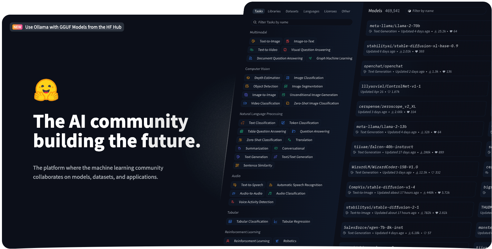
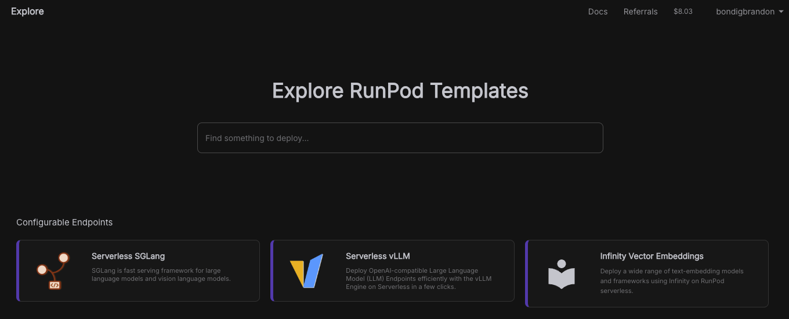
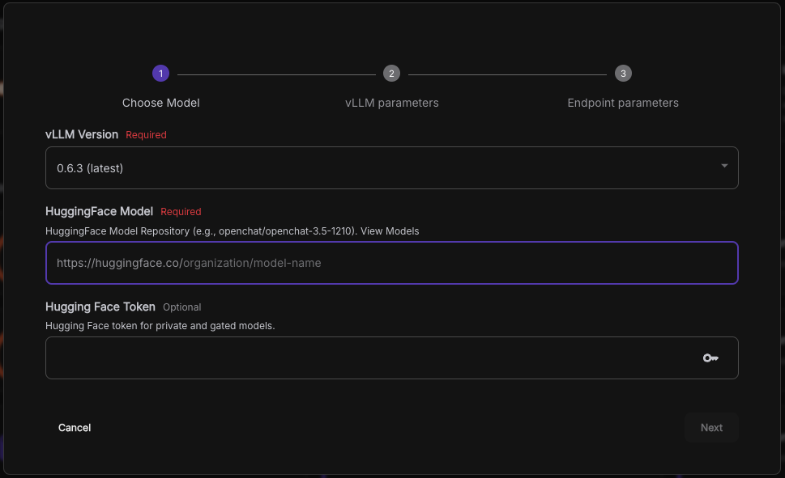
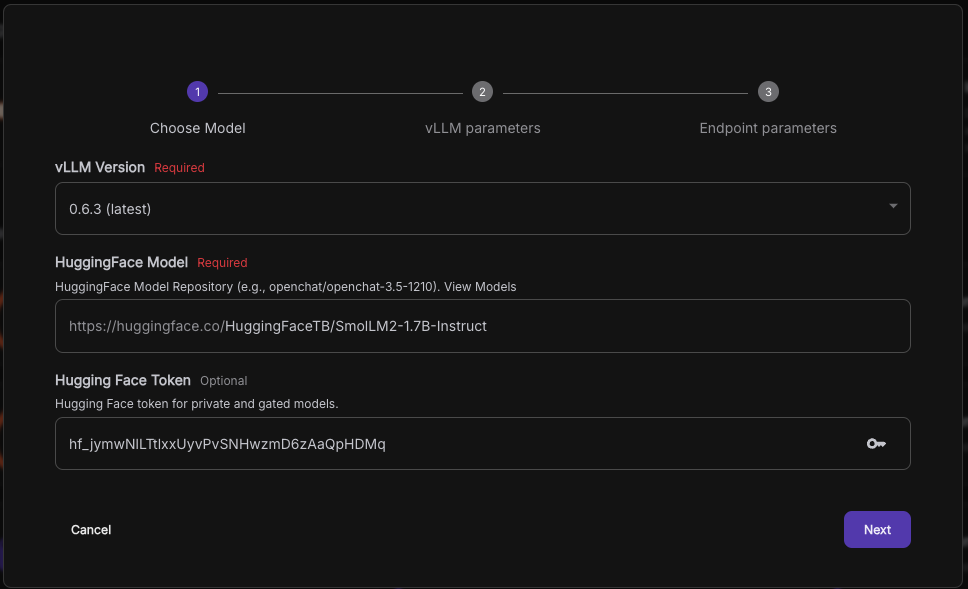
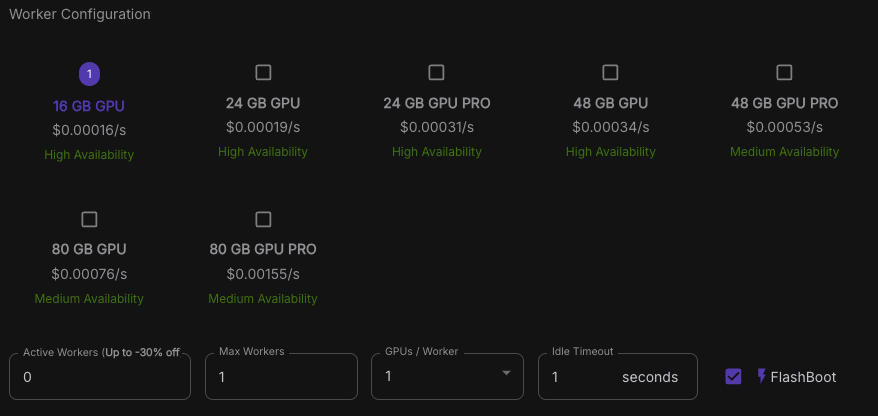
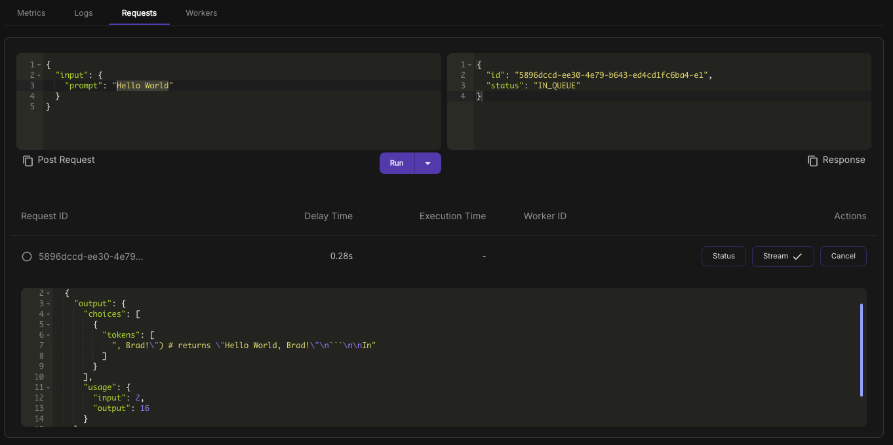

With so many LLM (Large Language Model) services now available, self-hosting your own model has become simpler and more accessible than ever. Runpod provides an easy way to deploy and manage your own LLM with minimal setup, giving you control over your data and costs. In this guide, we’ll cover the essentials of setting up your LLM on Runpod, from installation to optimization, so you can get started quickly.

## Table of contents

## Serverless worker

To get started, you’ll need to create an account on [Runpod](https://www.runpod.io/). Visit their website and click on the Sign up button to begin the registration process.

Once created, navigate to the **Explore** tab on the left side of the page.


Here, you’ll encounter several configurable endpoints and some pre-configured templates. Select **Serverless vLLM** to proceed.



> vLLM stands for Virtual Large Language Model and is an active open-source library that supports LLMs in inferencing and model serving efficiently.
> Here you get to choose what models you want the worker to run, these models are fetched via the Hugging Face API

You’ll see a few options here. For **vLLM Version**, keep it set to the latest version. In the Hugging Face model field, specify the model you’d like to use; you can explore available models by following the link or clicking [here](https://huggingface.co/models?pipeline_tag=text-generation&sort=trending).

In this example, I'll use the model called [**SmolLM2**](https://huggingface.co/HuggingFaceTB/SmolLM2-1.7B-Instruct), created by HuggingFaceTB.

Next, insert your Hugging Face token, which you can generate on the [token page](https://huggingface.co/settings/tokens).


_( Don't bother trying the API key, it is not valid )_

After selecting your preferred language model and entering the Hugging Face token, click Next to proceed.

You may encounter several configuration parameters for your LLM here; I’ll cover these in detail in a future post.

The final step is to configure your worker. If you already know which GPU best fits your requirements, select it here.


In this example, I’ll choose the RTX4000 16GB with 1 max worker and an idle timeout of 1 second.

Click Deploy and wait for the worker to complete its setup.

## Interacting with the worker

The worker activates on a per-request basis, meaning it spins up when you send a request to the specified endpoint, performs the necessary operations, delivers the output, and then shuts down. To make your first request to the worker running the LLM, click on the Requests tab.


The prompt on the left side is where you enter the message you want to send to the worker. The request body should already be populated with this prompt:

```json
{
  "input": {
    "prompt": "Hello World"
  }
}
```

When you click **Run**, the request body is sent to the worker, activating it. You’ll then receive the worker’s output, though this may take a moment to process.

````json
{
  "delayTime": 1184,
  "executionTime": 2566,
  "id": "0080e63c-5f8a-479b-811e-10e0c7bd68a8-e1",
  "output": [
    {
      "choices": [
        {
          "tokens": [
            "!\" Can be implemented using the following code:\n\n```python\nimport re"
          ]
        }
      ],
      "usage": {
        "input": 2,
        "output": 16
      }
    }
  ],
  "status": "COMPLETED",
  "workerId": "9zafw05neb6ch4"
}
````

The selected LLM may not have as many parameters as larger models, which can sometimes lead to hallucination in responses. However, its output is accessible at output[0].choices[0].tokens[0].

## Final words

This guide covers the essentials to get your LLM up and running on Runpod, but it doesn’t dive into every detail. In the future, we may explore a more in-depth setup where we’ll host a website that allows users to interact with the LLM directly—much like a ChatGPT-style messaging site. Stay tuned for updates as we expand on this project!
