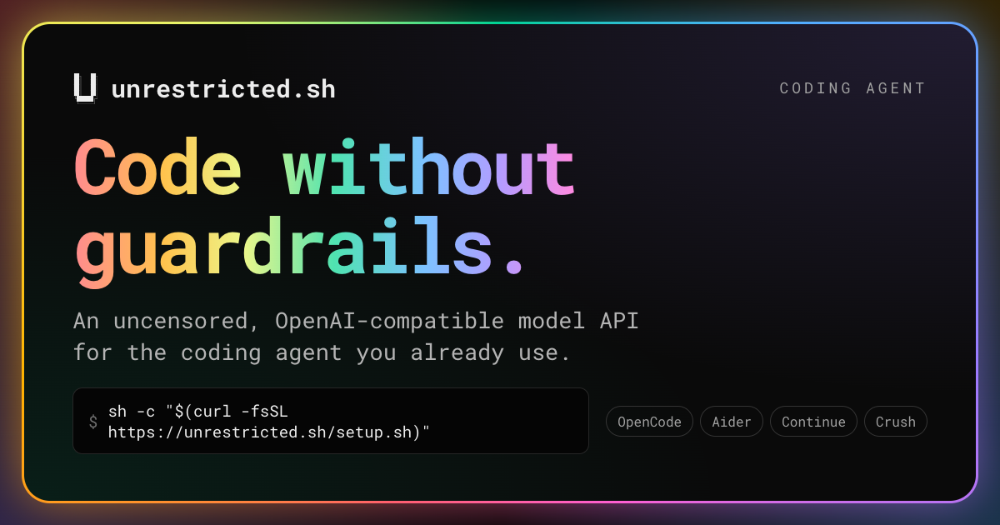

[unrestricted.sh](https://unrestricted.sh) is an uncensored coding model served over an OpenAI-compatible API. One command wires it into the coding agent you already use, prompts are never stored, and you pay per token on GPUs that scale to zero when nobody is asking anything.

This post covers why I built it, what runs underneath, and the engineering that took a cold start from five minutes down to under thirty seconds.

## Table of contents

## The problem: refusals in the middle of real work

Mainstream models are good at code and bad at a specific slice of it. Ask for a proof-of-concept exploit for a CVE you are paid to reproduce, a parser for a malware sample, a keygen for your own licensing code, or a scraper that ignores a robots file on your own site, and you get a lecture instead of an answer.

The open-weight world solved this a while ago. Abliterated and uncensored finetunes are among the most downloaded models on Hugging Face. The catch is hardware: a 27B model at a usable quantisation wants a 48 GB card. Most people do not have one sitting under the desk, and the large hosted providers will not serve these models for policy reasons.

That gap is the whole product: **the models you cannot run at home, from the hosts that will not serve them.**

## What it is

- **An OpenAI-compatible API** at `https://api.unrestricted.sh/v1` — `/chat/completions`, `/completions`, `/responses`, `/models`.
- **An Anthropic-compatible surface** — `/v1/messages` and `/v1/messages/count_tokens`, so clients that speak Anthropic's Messages API work too.
- **One-command setup** — `sh -c "$(curl -fsSL https://unrestricted.sh/setup.sh)"` detects OpenCode, Aider, Continue and Crush, asks which to configure, and merges a provider block into each tool's config without touching the rest of it. It signs you in through the browser with RFC 8628 device authorisation and mints a key for that machine.
- **A chat playground** at `/chat` for when you just want to ask something, with history encrypted in your own browser.

The model today is **Qwen3.8 27B Uncensored** (the OrcaRouter build, `Q5_K_M`) with a **262K context**, at **$2 per million input tokens and $6 per million output**.

## The stack

| Layer     | Choice                                                                            |
| --------- | --------------------------------------------------------------------------------- |
| Web app   | Next.js 16, React 19, Tailwind v4, Prisma on Postgres, better-auth magic links    |
| Hosting   | Render, Cloudflare DNS, Stripe for payments                                       |
| Inference | llama.cpp (pinned commit, patched) on RunPod serverless, load-balancing endpoints |
| GPU       | NVIDIA A40 48 GB, one worker per request burst, scale to zero                     |

Nothing exotic. The interesting parts are all in the seams between them.

## Serverless GPUs: the cold start problem

Scale-to-zero is what makes a service like this affordable at low traffic. It is also what makes the first message slow. The first version took **five minutes** to answer, and the trail of fixes is the most transferable part of this project.

| Fix                                                                                  | Cold start |
| ------------------------------------------------------------------------------------ | ---------- |
| Original: apt-installing packages and copying binaries from a network volume at boot | 5 min 07 s |
| Bake everything into the image, built by RunPod from the repo                        | ~90 s      |
| RunPod cached models: weights staged on host-local NVMe instead of a network volume  | ~43 s      |
| Report readiness early and hold the request in-container                             | **~27 s**  |

That last one needs explaining, because it is not obvious.

RunPod's load balancer polls a health port and only routes traffic to a worker once it answers `200`. llama.cpp answers `503` while it loads the model, which RunPod reads as unhealthy and would drop the worker, so the image runs a small health responder that answers "initializing" until the model is up. The problem: while the responder says "initializing", the load balancer backs off, and the request sat in the balancer for **13 to 28 seconds after the GPU was ready to serve it**. The model load itself was only nine seconds.

The fix is a ~600-line Python front process in the container. It takes the request port, moves llama-server to loopback, and:

- **Reports ready immediately** when the weights are already on local disk, so the balancer starts routing during the load.
- **Holds incoming requests** (up to 20 s) while llama-server finishes loading, then relays them, streaming chunk by chunk with no buffering.
- **Answers `/ping` and `/health`** on both ports, closes the upstream connection the moment a client disconnects, and logs one line per health check so the poll interval is measurable rather than guessed.

With that in place, the balancer's checks turn out to run every five seconds once it sees a healthy worker. A cold start is now ~7 s container start, ~10 s model load, ~6 s of routing, and the reply.

## Coding agents are prefill-heavy, and that changes everything

My own usage over a month: **8.7M input tokens against 198K output**, a 44:1 ratio. Coding agents send whole files, tool definitions and conversation history on every step.

That shapes the economics and the user experience:

- **Prefill runs at ~1,000–1,200 tokens/s** on an A40; decoding runs at ~50 tokens/s.
- A single 82K-token agent step therefore spends **about 80 seconds reading** before the first token comes out. The agent shows a spinner and users assume it is "thinking"; it is not, it is ingesting.
- Prefill is also where the margin is: at $2 per million input tokens against roughly $0.34 per million of GPU time, large prompts pay well.

llama.cpp reuses a cached prefix when the same conversation lands on the same warm worker, and you can see it in the logs picking a slot by longest common prefix and processing only the new tokens. Anything that changes early in the prompt, though, invalidates everything after it.

## Billing in microcents

Money is counted in **microcents** — millionths of a cent — because a price in cents per million tokens makes one token cost `tokens × cents-per-million` microcents exactly. Columns are `BIGINT`, and nothing above the data layer ever sees a float.

Each request estimates the prompt cost up front and refuses if the wallet cannot cover it, debits in batches while the reply streams, and settles exactly once at the end against the real usage from the backend — refunding or charging the difference in the same transaction as the ledger entry. A request the backend failed costs nothing. A client that hangs up mid-stream still settles.

Two policies exist because serverless GPUs bill by the second while customers pay by the token:

- **A $0.01 wake fee** on a request that wakes a sleeping GPU, so a cold start followed by one short question is not a loss. Nothing extra is charged while the model is already running.
- **Three concurrent requests per account**, enforced with short-lived leases in Postgres, which is enough for a coding agent's parallel tool calls without one account monopolising a worker.

## Privacy: what is and is not kept

The claim on the site is narrow on purpose, because I audited it rather than assumed it:

- **Prompts and replies are never stored.** The database has no column for message content; six days of application logs contained none.
- **Chat history lives in your browser**, encrypted in IndexedDB with a key derived per account, and is never uploaded.
- **What is kept** is usage metadata: who, when, which model, token counts, cost, latency, status — which is what billing needs.
- **What passes through** are the hosts in the path: Render, RunPod and Cloudflare handle requests in transit, and the GPU provider keeps operational logs for up to 90 days.

If someone asked me for a user's past conversations, I could not produce them. That is a property of the architecture, not a promise in a policy document.

## Who it is for

Security researchers, pentesters, CTF players and reverse engineers who hit refusals on legitimate work. People who want an agent that writes the code and skips the disclaimer. Anyone who wants an uncensored model that needs a 48 GB card without buying one.

It is not a frontier model. For everyday application code, Claude and GPT are stronger, and I would not pretend otherwise. This is for the work they will not touch.

## Where it goes next

- **A bigger tier.** A 70B or 123B uncensored model on a 96 GB card is the natural next step, and the economics work out at about three concurrent users.
- **Cheaper cached input**, since a re-sent prefix costs the GPU almost nothing and agents re-send constantly.
- **Dedicated workers by the hour** for heavy users who want no queueing and no cold starts.

New accounts get $0.10 of credit to try it, which is a few hundred thousand tokens — enough to see whether the model is any good at your kind of work. The site is [unrestricted.sh](https://unrestricted.sh).
